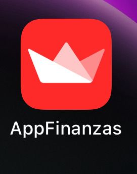
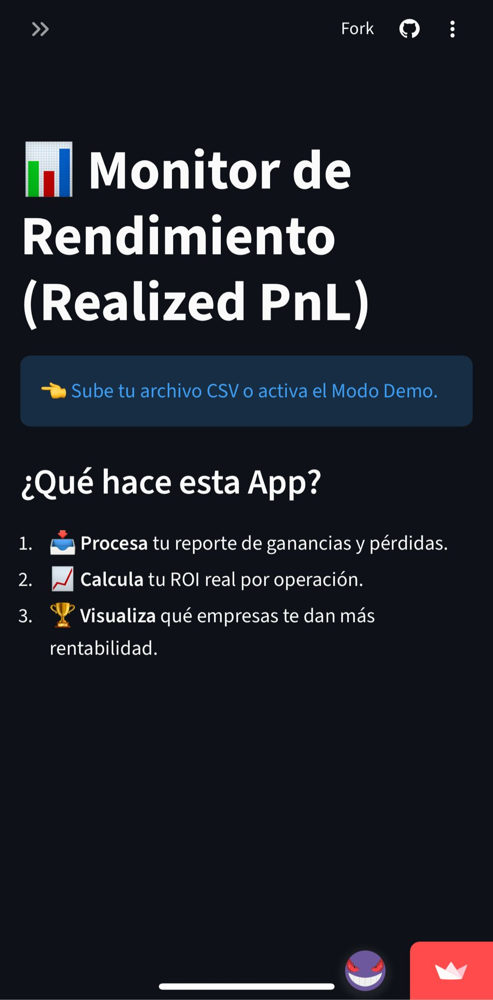
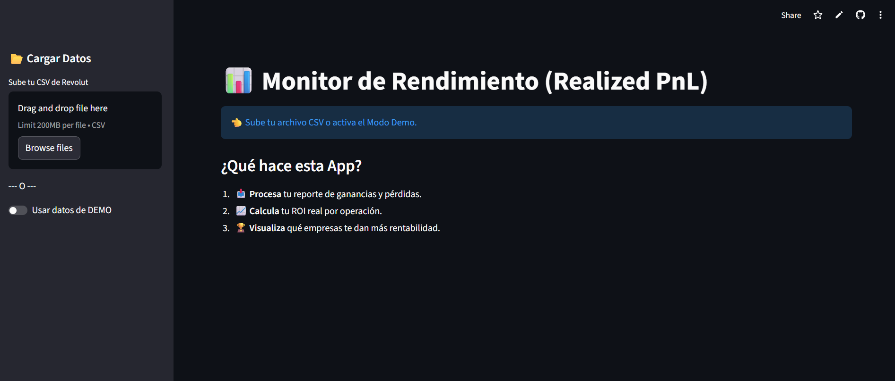

# 📊 Revolut Trading Dashboard

> **Analiza tu rendimiento en bolsa de forma profesional, privada y limpia.**


Esta aplicación transforma los archivos CSV de **Profit & Loss** de Revolut (que son difíciles de leer) en un **Dashboard Interactivo** visual. Te permite entender tu ROI real, ver tu evolución mes a mes y analizar la curva de ganancias de cada empresa individualmente.

## 🚀 Características

* **KPIs Globales:** Visualiza instantáneamente tu Capital Operado, Beneficio Neto y ROI Operativo.
* **Análisis Mensual:** Gráficos de barras para ver qué meses fuiste rentable.
* **Detalle por Empresa:**
    * Curva de beneficio acumulado (Step Chart) para ver *cuándo* ganaste dinero.
    * Tabla detallada de cada operación (compra/venta).
* **Clean Architecture:** El código no es un script suelto. Está estructurado usando patrones de diseño (Strategy & Adapter) para ser modular y escalable.
* **Privacidad Total:** Los datos se procesan en memoria y no se guardan en ningún servidor.
  
## 📱 Cómo instalar en el móvil (iOS y Android)

Puedes instalar este Dashboard en tu teléfono como si fuera una aplicación nativa (sin barras de navegador y a pantalla completa).

URL: https://app-finanzas.streamlit.app/

### En iPhone (iOS)
1. Abre la URL de la app en **Safari**.
2. Pulsa el botón **Compartir** (cuadrado con flecha hacia arriba ⬆️).
3. Busca y selecciona **"Añadir a pantalla de inicio"**.
4. Dale a "Añadir".

### En Android
1. Abre la URL de la app en **Chrome**.
2. Pulsa los **tres puntos** (⋮) arriba a la derecha.
3. Selecciona **"Instalar aplicación"** o **"Añadir a pantalla de inicio"**.
4. Confirma la instalación.

¡Ahora tendrás el icono en tu menú y podrás consultar tus inversiones en cualquier momento!

<p align="center">
  
  
  &nbsp; &nbsp; 
</p>
## 🛠️ Instalación y Uso Local

Si prefieres ejecutarlo en tu propio ordenador:

1.  **Clona el repositorio:**
    ```bash
    git clone https://github.com/pabloski13131313/App-Finanzas.git
    cd App-Finanzas
    ```

2.  **Instala las dependencias:**
    ```bash
    pip install -r requirements.txt
    ```

3.  **Ejecuta la aplicación:**
    ```bash
    streamlit run dashboard.py
    ```
    *Se abrirá automáticamente una pestaña en tu navegador.*
<br> <p align="center">
  
</p>

<br>

## 📂 Cómo obtener tus datos

Para que la app funcione, necesitas el archivo oficial de Revolut:

1.  Abre la App de Revolut.
2.  Ve a la sección **Stocks (Acciones)**.
3.  Pulsa en **"..." (Más)** -> **Statements (Extractos)**.
4.  Selecciona **Profit and Loss**.
5.  Elige el rango de fechas (ej. último año) y descarga el **CSV**.
6.  ¡Sube ese archivo al Dashboard!

## 🏗️ Arquitectura del Proyecto

Este proyecto sigue principios de **Clean Architecture** para desacoplar la lógica financiera de la interfaz gráfica:

* `dashboard.py`: **Vista (View)**. La interfaz gráfica construida con Streamlit.
* `portfolio.py`: **Controlador**. Gestiona la cartera y orquesta el flujo de datos.
* `strategies.py`: **Patrón Strategy**. Define cómo se calcula el rendimiento (ROI, Z-Score, etc.) sin atarlo a los datos.
* `parsers.py`: **Patrón Adapter**. Se encarga de leer y limpiar el CSV "sucio" de Revolut para convertirlo en objetos limpios.
* `transaction.py`: **Modelo (DTO)**. Definición de la estructura de datos de una operación.

## 🔒 Privacidad y Seguridad

* Esta aplicación es **Open Source**. Puedes revisar el código para verificar que no hay envío de datos externos.
* Al ejecutarlo en **Streamlit Cloud**, los archivos subidos se procesan en la memoria RAM del servidor temporal y se eliminan en cuanto cierras la pestaña o recargas la página.

---
*Desarrollado con ❤️ para inversores retail.*
