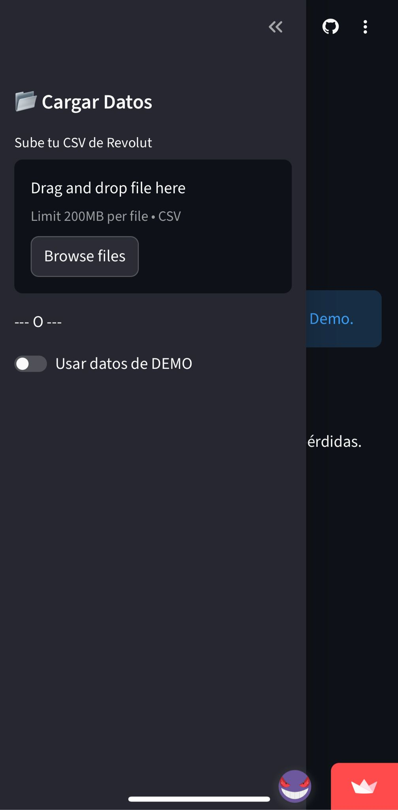

# 📊 Revolut Trading Dashboard

> **Business Intelligence para tus inversiones: Analiza tu rendimiento en bolsa de forma profesional, privada y limpia.**


Esta aplicación transforma los reportes crudos (**Profit & Loss**) de Revolut en un **Dashboard Interactivo** de alto nivel. Diseñado para inversores que buscan entender su ROI real, visualizar la evolución temporal de su cartera y analizar la rentabilidad por activo con datos precisos.

🔗 **Acceder a la App:** [https://app-finanzas.streamlit.app/](https://app-finanzas.streamlit.app/)

---

## 🚀 Características Principales

* **📈 KPIs Financieros en Tiempo Real:** Visualización instantánea de métricas clave: Capital Movido, Beneficio Neto (PnL) y ROI % Total.
* **🧪 Modo Demo con Datos Reales:** ¿No tienes el CSV a mano? Activa el modo Demo para cargar un portafolio simulado basado en **precios históricos reales de 2023**.
    * Incluye operaciones de gigantes tecnológicos (Tesla, Nvidia, Apple, Microsoft...).
    * Calcula ganancias exactas basadas en la cotización real de las fechas de compra y venta.
* **📅 Análisis Temporal:** Gráficos de barras mensuales para identificar tendencias de estacionalidad y consistencia en el trading.
* **🏢 Detalle por Activo (Drill-Down):**
    * **Gráfico de Rendimiento (Growth Chart):** Visualiza la curva de crecimiento del capital invertido en cada empresa desde la fecha de compra.
    * **Tabla de Operaciones:** Desglose detallado con fechas de adquisición, venta, cantidades y ROI individual.
* **🔒 Privacidad "Client-Side":** Los datos se procesan exclusivamente en memoria RAM. No se almacenan en ninguna base de datos ni servidor persistente.

## 📖 Guía de Uso

### ⚡ Prueba Rápida (Sin Archivos)
1. Abre la aplicación.
2. En la barra lateral izquierda, activa el interruptor: **"Usar datos de DEMO"**.
3. ¡Listo! La aplicación cargará automáticamente un escenario histórico real para que explores todas las funcionalidades.

### 📂 Analiza tus Propios Datos
Para visualizar tu cartera real, necesitas el reporte oficial de Revolut:

1. Abre la App de Revolut.
2. Ve a la sección **Stocks (Acciones)**.
3. Pulsa en **"..." (Más)** -> **Statements (Extractos)**.
4. Selecciona **Profit and Loss**.
5. Elige el rango de fechas (ej. último año) y descarga el **CSV**.
6. Sube el archivo en el panel lateral del Dashboard.

---

## 📱 Instalación Nativa (PWA)

Puedes instalar este Dashboard en tu dispositivo móvil iOS o Android para que funcione como una **App Nativa** (pantalla completa, sin barras de navegador e icono propio).

### En iPhone (iOS)
1. Abre la URL de la app en **Safari**.
2. Pulsa el botón **Compartir** (icono cuadrado con flecha ⬆️).
3. Selecciona **"Añadir a pantalla de inicio"**.
4. Nombra la app (ej: *AppFinanzas*) y confirma.

### En Android
1. Abre la URL de la app en **Chrome**.
2. Pulsa los **tres puntos** (⋮) arriba a la derecha.
3. Selecciona **"Instalar aplicación"** o **"Añadir a pantalla de inicio"**.
4. Confirma la instalación.

<table border="0" width="180%">
  <tr>
    <td align="center" valign="middle" width="20%">
      
    </td>
   <td align="center" valign="middle" width="40%">
      
    </td>
    <td align="center" valign="middle" width="40%">
      
    </td>
  </tr>
  <tr>
    <td align="center"><br><b>Icono App</b></td>
    <td align="center"><br><b>Vista App Móvil</b></td>
    <td align="center"><br><b>Vista de carga o Demo Móvil</b></td>
  </tr>
</table>

---

## 🏗️ Arquitectura de Software

Este proyecto no es un simple script; sigue principios de **Clean Architecture** y **SOLID** para garantizar mantenibilidad y escalabilidad:

| Componente | Patrón / Rol | Descripción |
| :--- | :--- | :--- |
| `dashboard.py` | **View (UI)** | Interfaz gráfica reactiva construida con Streamlit. |
| `portfolio.py` | **Controller** | Orquesta el flujo de datos y gestiona la lógica de negocio de la cartera. |
| `strategies.py` | **Strategy Pattern** | Encapsula los algoritmos de cálculo de rendimiento (ROI, PnL), permitiendo cambiar la estrategia sin tocar el código base. |
| `parsers.py` | **Adapter Pattern** | Adapta y normaliza los datos "sucios" del CSV de Revolut a una estructura de objetos limpia. |
| `transaction.py` | **Model (DTO)** | Definición tipada de la estructura de datos de una operación financiera. |


## 🛠️ Instalación y Uso Local

Si prefieres ejecutarlo en tu propio ordenador:

1.  **Clona el repositorio:**
    ```bash
    git clone https://github.com/pabloski13131313/App-Finanzas.git
    cd App-Finanzas
    ```

2.  **Instala las dependencias:**
    ```bash
    pip install -r requirements.txt
    ```

3.  **Ejecuta la aplicación:**
    ```bash
    streamlit run dashboard.py
    ```
    *Se abrirá automáticamente una pestaña en tu navegador.*

<table border="0" width="100%">
  <tr>
    <td align="center" >
       
    </td>
   
  </tr>

  <tr>
    <td align="center">
      <br> <b>Vista App PC</b>
    </td>
  </tr>
</table>
## 🔒 Privacidad y Seguridad

* Esta aplicación es **Open Source**. Puedes revisar el código para verificar que no hay envío de datos externos.
* Al ejecutarlo en **Streamlit Cloud**, los archivos subidos se procesan en la memoria RAM del servidor temporal y se eliminan en cuanto cierras la pestaña o recargas la página.

---
*Desarrollado con ❤️ para inversores retail.*
